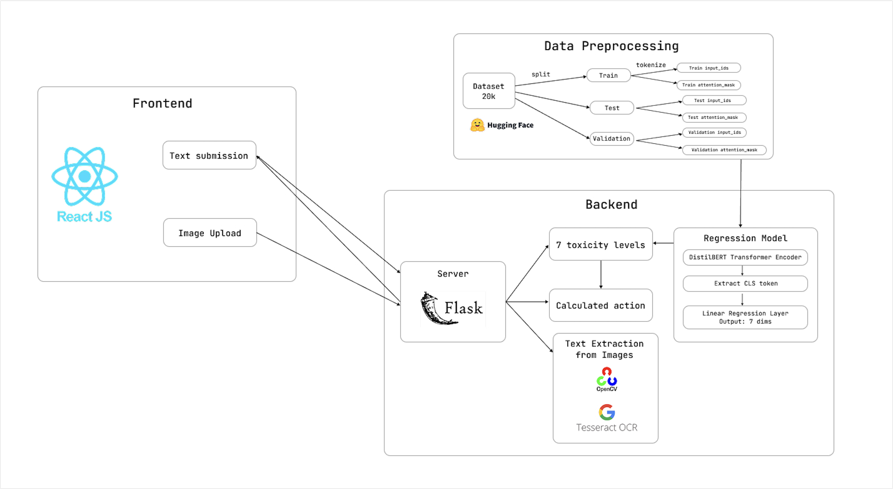
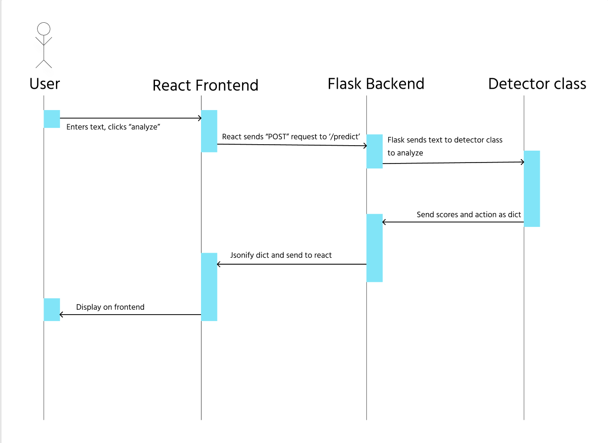
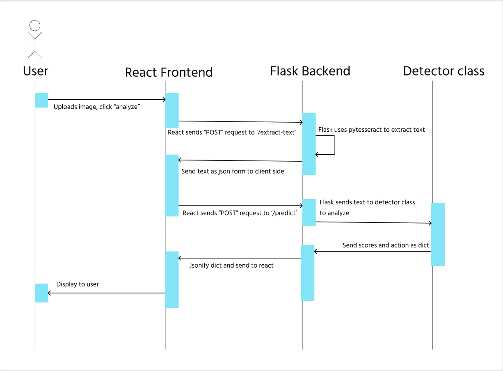

# toxicity-detector


## **Description**

This project is a simple NLP toxic comment detector coupled with an user-friendly interface. The model itself uses transfer learning, taking [DistilBERT](https://huggingface.co/distilbert/distilbert-base-uncased), a well-known language modeling transformer, and is fine tuned into a regressor. The model was trained on [this dataset](https://huggingface.co/datasets/Koushim/processed-jigsaw-toxic-comments) using Torch. The model outputs a vector of 7 scores measuring 7 different variations of toxicity, which is further fit into the range of [0,1]. Weighted scores and threshold logic was used to determine a subsequent action of either flagging, warning, or banning. User can also upload screenshots where text can be extracted using tesseract and inputted to the model.

The project also explores simple CSS animations and was great practice for brushing up UI skills.

## **Tech Stack**
**Frontend**: Created with React

**Backend**: Powered using Flask server

**ML**: Transfer learning with DistilBERT transformers model and a dataset of 20,000 comments using Torch. Trained on [Google Colab](https://colab.research.google.com/drive/1gfbBc1hSW60OOB7IIjpzwmpEYMBt-PlH?usp=sharing).

**Utilities**: Text from image extraction done using tesseract. 

## **How It Works**




## **Installation**
Make sure you have Python3 and node installed.

If not already, have `tesseract` and `git-lfs` installed.

macOS instructions:
```
brew install tesseract
brew install git-lfs
git lfs install
```
Clone the repository:
```
git clone https://github.com/addinar/toxicity-detector.git
```
Install dependencies and activate virtual environment for backend.

macOS instructions:
```
cd backend
python3 -m venv venv
source venv/bin/activate
pip install -r requirements.txt
```

## **Running the Application**
Open a double terminal.

On one terminal:
```
cd backend
python app.py
```
On the other terminal:
```
cd frontend
npm run dev
```
## Lisence
Distributed under the MIT License.
